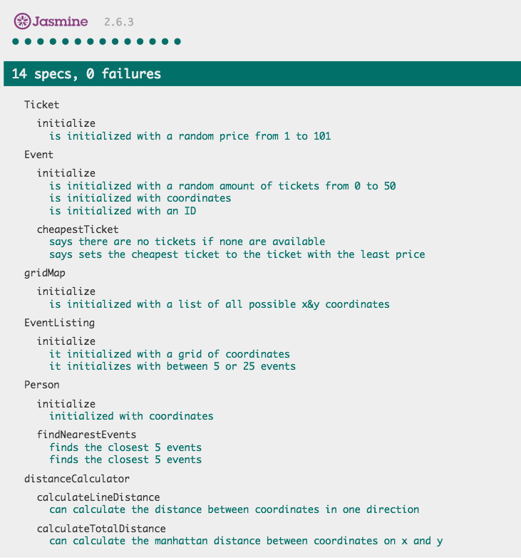
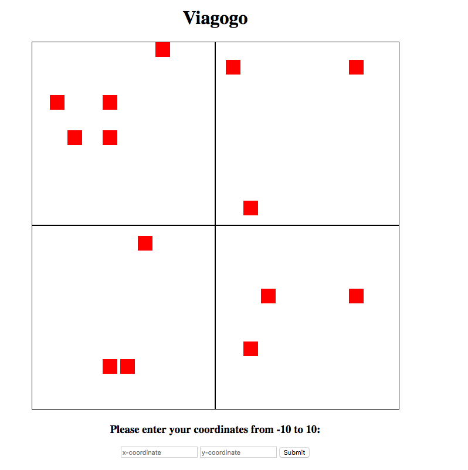
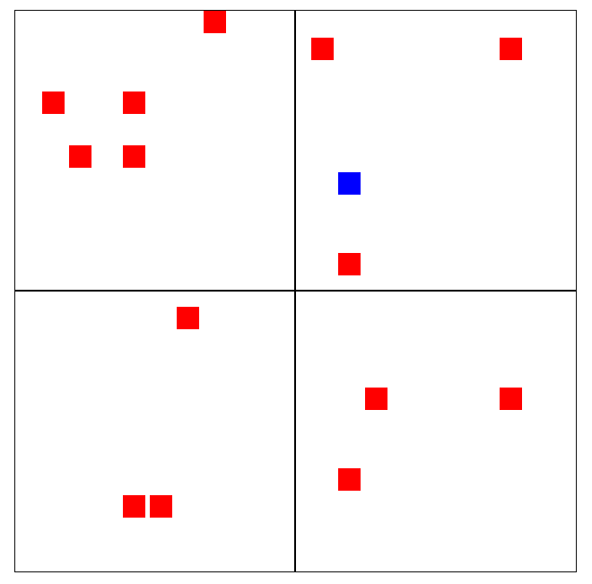
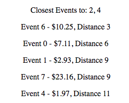

# Event Mapper

## Scenario
• Your program should randomly generate seed data.

• Your program should operate in a world that ranges from -10 to +10 (Y axis), and -10 to
+10 (X axis).

• Your program should assume that each co-ordinate can hold a maximum of one event.

• Each event has a unique numeric identifier (e.g. 1, 2, 3).

• Each event has zero or more tickets.

• Each ticket has a non-zero price, expressed in US Dollars.

• The distance between two points should be computed as the Manhattan distance.

## Instructions
You are required to write a program which accepts a user location as a pair of
co- ordinates, and returns a list of the five closest events, along with the cheapest
ticket price for each event.

## My Process

I originally intended for this to be a purely back-end project, which I was going to write
in javascript and running it in node. But as I progressed with it, I decided it would be
much easier to visualise with a simple front-end aspect too.

I began with the back-end and broke down the program to its simplest constituent parts.
I have constructor functions for the following:

#### What's Involved

The __Ticket__ : This has a randomly generated price from 1.00 to 101.00.

The __Event__ : This is generated with a random amount of tickets, coordinates, and a unique
ID. It also has the ability to find out which is its cheapest ticket.

The __GridMap__ : This is a map of coordinates. It is given the parameters of the grid, and
calculates ever possible integer coordinate available within it.

The __EventListing__ : This is constructed with a GridMap that sets the limitations of the
world. It then generates a random amount of events within this world. When an event is
created, those coordinates are removed from the GridMap making it unavailable.

The __DistanceCalculator__ : This calculates the Manhattan distance of a two coordinates.
It first calculates the distance of a line, so from x to x, and then calculates from y to y.

The __Person__ : This is constructed with an EventListing, coordinates and a
DistanceCalculator. With knowledge of its own coordinates and all the events' coordinates,
it can then calculate the closest five events.

The __FrontEnd__ : This is a visualisation of the backend. When the document loads,
an EventListing is displayed. All the events in the listing are shown on a grid. The user
then has an ability to input coordinates which generates a Person. These coordinates
are also displayed on the grid and underneath it shows the information of the closest
five events and their cheapest ticket.

## How to Run

Clone this repository and then enter the root directory by typing the
following into the terminal:

```
git clone git@github.com:jackbittiner/Viagogogogogo.git
cd Viagogogogogo
```

### Testing

This program was test-driven. To see the tests in all their passing glory
enter the following command in the command line:

```
open SpecRunner.html
```

and you should see the following:



### The Program

Enter the following command in the command line:

```
open viagogo.html
```

and you should see a grid of randomly positioned events, and two input fields
for you to put down your coordinates like so:



Input your desired coordinates and click submit. You should see a new blue
square on the grid that represents your coordinate like so:



Also the nearest five events appear under the grid, showing the unique
event ID, the cheapest ticket price, and the distance from the user:



## Technologies Used

__Javascript__: Although I'm probably better at showing good, clean coding practices
in Ruby, I wanted to showcase my abilities in Javascript because it is a more common,
more universal language and I do enjoy writing in it.

__Jasmine__: For the testing.

__HTML__: For the visualisation of the back-end.

__JQuery__: For a dynamic front-end that handles the event of user input.
